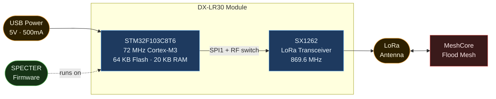
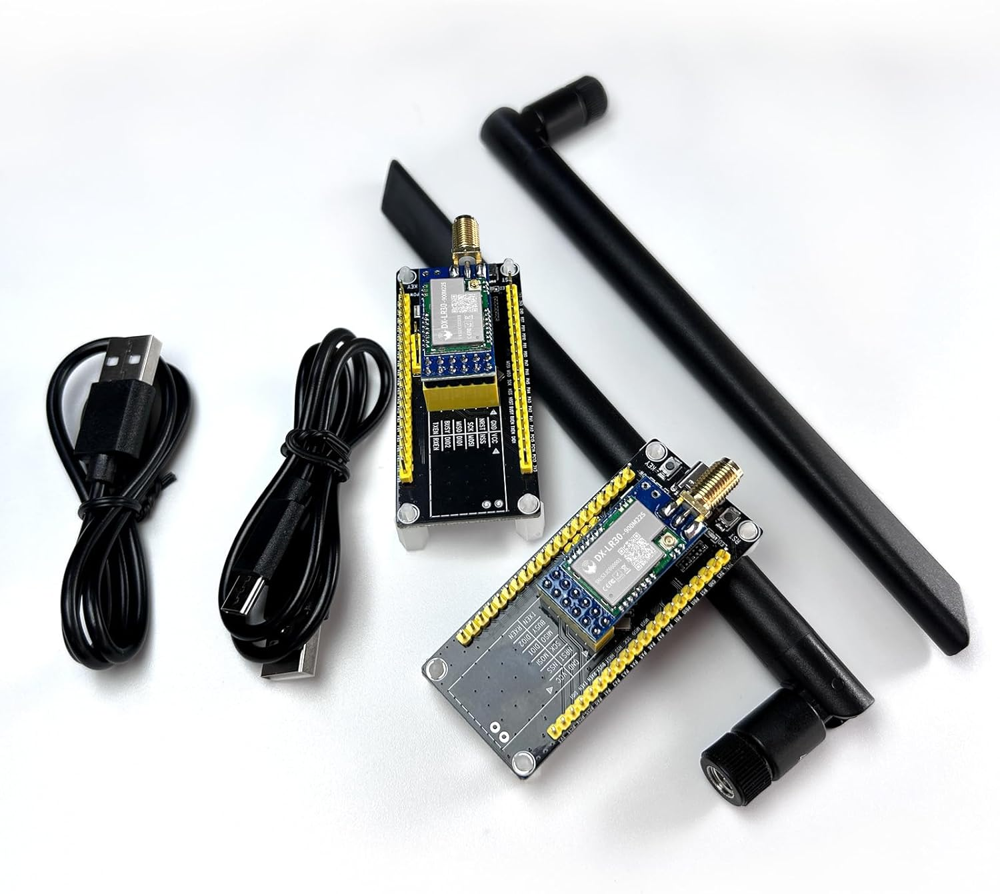
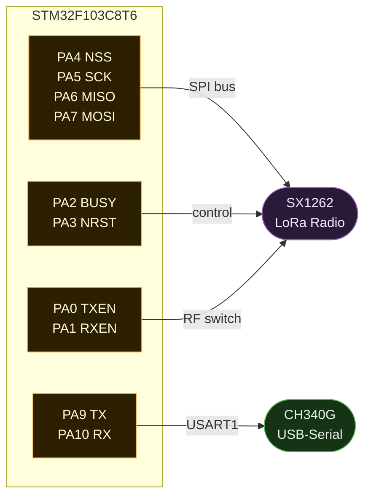
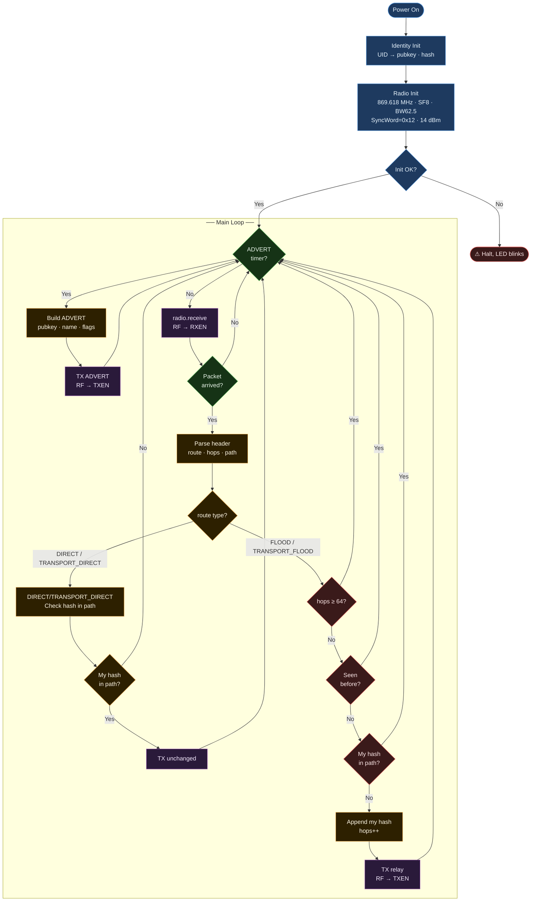
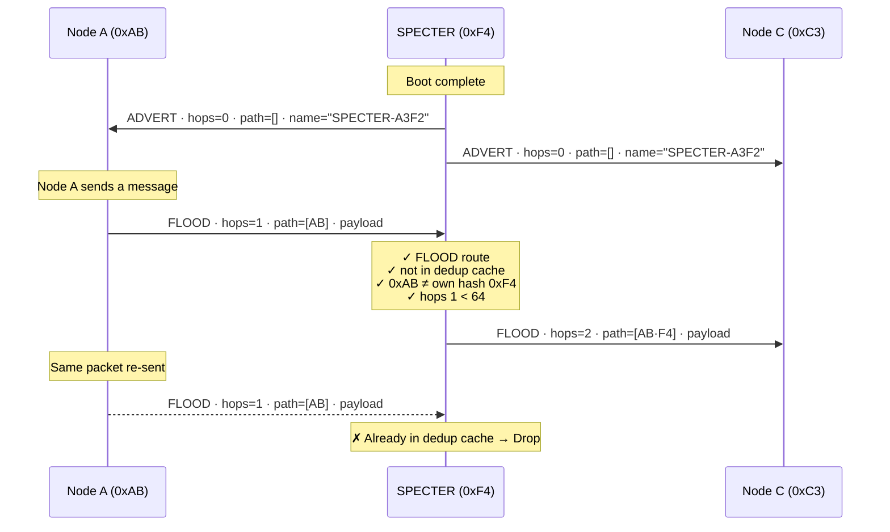
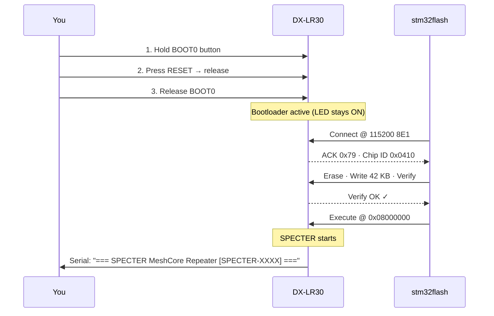

# SPECTER Native MeshCore Repeater for DX-LR30

> The DX-LR30 is a cheap Chinese LoRa shell device. MeshCore has no official
> firmware for STM32F103 + SX1262.

---

## What is this?

A fully autonomous **MeshCore flood repeater** running native C++ firmware on a
**DX-LR30** hardware module, an STM32F103C8T6 microcontroller paired with an
SX1262 LoRa transceiver. No Linux, no Python, no host PC required after flashing.
Plug in USB power and it joins the MeshCore network.

Each device automatically gets a unique node name (`SPECTER-XXXX`) derived from
its STM32 hardware UID. No configuration needed. To use a custom callsign, add
one line to `platformio.ini` (see [Customizing the node name](#customizing-the-node-name)).



---

## Hardware



| Component | Part | Notes |
|-----------|------|-------|
| MCU | STM32F103C8T6 | 72 MHz Cortex-M3, 64KB Flash, 20KB RAM |
| Radio | SX1262 | Sub-GHz LoRa, up to +22 dBm |
| USB-Serial | CH340 | Bootloader access via physical BOOT0+RESET buttons |
| LED | PB11 | Active HIGH — 1 blink = RX · 2 fast blinks = relay · solid = ADVERT TX |

### Pin Map



> SPI bus: **SPI1** (PA5/PA6/PA7). Serial console: **USART1** (PA9/PA10).
> DIO1 is not exposed on the DX-LR30 module, RadioLib runs in **polling mode**.

---

## Firmware Architecture



---

## MeshCore Protocol

SPECTER implements the **MeshCore v1 flood routing** protocol.



### Packet Header Format

```
Byte 0:  [ver(2)] [payload_type(4)] [route_type(2)]
           ↑                              ↑
           0x00              TRANSPORT_FLOOD = 0x00
                                     FLOOD = 0x01
                                    DIRECT = 0x02
                          TRANSPORT_DIRECT = 0x03

Byte 1:  [hash_size_code(2)] [hop_count(6)]

Bytes 2..N: path hashes (hop_count × hash_size bytes)
Bytes N..:  payload (ADVERT / MESSAGE / etc.)
```

### Routing Behaviour

| Route type | Value | SPECTER action |
|---|---|---|
| `TRANSPORT_FLOOD` | `0x00` | Relay — append own hash, flood |
| `FLOOD` | `0x01` | Relay — append own hash, flood |
| `DIRECT` | `0x02` | Relay unchanged **if** own hash is in pre-built path |
| `TRANSPORT_DIRECT` | `0x03` | Relay unchanged **if** own hash is in pre-built path |

For **FLOOD** types: dedup cache + loop detection (own hash already in path) prevent
storms. For **DIRECT** types: the full route is pre-computed by the source node;
SPECTER only forwards if it is on that route.

### Radio Configuration

| Parameter | Value | Why |
|-----------|-------|-----|
| Frequency | 869.618 MHz | EU868 MeshCore channel |
| Spreading Factor | SF8 | Balance range/speed |
| Bandwidth | 62.5 kHz | Narrow, more range |
| Coding Rate | 4/8 | EU/UK Narrow preset standard |
| Sync Word | 0x12 | LoRa private network |
| TX Power | 14 dBm | Compliant + range |
| CRC | 16-bit | Enabled |

---

## Building

### Prerequisites

```bash
pip install platformio
# or: brew install platformio
```

### Dependencies

Managed automatically by PlatformIO via `lib_deps` in `platformio.ini`:

| Library | Version | Purpose |
|---------|---------|---------|
| [RadioLib](https://github.com/jgromes/RadioLib) | ^7.6.0 | SX1262 driver (polling mode, RADIOLIB_NC) |
| [rweather/Crypto](https://github.com/rweather/arduinolibs/tree/master/libraries/Crypto) | ^0.4.0 | SHA256 + Ed25519 for deterministic key derivation and ADVERT signing |
| IWatchdog (STM32duino built-in) | 1.0.0 | Independent Watchdog — auto-reset on radio HALT or loop freeze |

No manual installation needed, `pio run` fetches them automatically.

### Build

```bash
cd dx-lr30-fw
pio run -e specter
# Output: .pio/build/specter/firmware.bin  (~50KB)
```

### Memory Usage

```
RAM:   ██░░░░░░░░  15.2%  (3116 / 20480 bytes)
Flash: ████░░░░░░  38.5%  (50408 / 131072 bytes)*
```

\* Many STM32F103C8T6 clones have 128KB flash (labeled as 64KB). SPECTER
fits comfortably in genuine 64KB chips as well (~79% utilization).

---

## Flashing

The DX-LR30's CH340 USB-serial chip does **not** support automatic bootloader
entry via DTR/RTS in software. Use the **physical buttons**.



### Quick flash

```bash
./flash.sh            # build + flash (prompts you to enter bootloader)
./flash.sh --no-build # flash only
./flash.sh --monitor  # flash + open serial monitor
```

### Manual flash

```bash
# 1. Enter bootloader: hold BOOT0, press RESET, release BOOT0
# 2. Flash:
stm32flash \
  -w .pio/build/specter/firmware.bin \
  -v -R -b 57600 \
  /dev/ttyUSB0
```

> ⚠️ **CRITICAL:** Use `-b 57600` (not 115200) on this board. See [docs/development-notes.md](docs/development-notes.md#critical-stm32-bootloader-baud-rate) for why.

---

## Serial Monitor

Connect at **115200 8N1** on `/dev/ttyUSB0`. Press RESET to see startup:

```
=== SPECTER MeshCore Repeater v1.1.0 [SPECTER-A3F2] ===
Hash: 0xF4
Radio init... OK
ADVERT initial
ALIVE uptime=10s
ALIVE uptime=20s
RX RSSI=-87 SNR=7 len=110
Relay hop=2
Drop: dedup
ALIVE uptime=30s
```

> The node name (`SPECTER-A3F2`) and hash are unique per device.

```bash
# Quick monitor
python3 -m serial.tools.miniterm /dev/ttyUSB0 115200

# Or
./flash.sh --monitor
```

---

## Identity

SPECTER derives each node's identity from the **STM32 unique device ID**
(96-bit UID at `0x1FFFF7E8`). This guarantees a stable, unique identity
without EEPROM or external storage.

### Cryptographic Identity

Each node has a unique **Ed25519 keypair** derived deterministically:

```cpp
private_key = SHA256("SPECTER-MESHCORE-KEY-V1" || 96-bit_UID)
public_key  = Ed25519::derivePublicKey(private_key)
path_hash   = public_key[0]  // 1-byte routing hash
```

- **Deterministic**: Same keys on every boot (no storage needed)
- **Unique**: Factory-unique UID ensures different keys per chip
- **Secure**: Ed25519 provides 128-bit security level

### Node Name

Auto-generated from UID:
```cpp
name = "SPECTER-" + hex(uid[2] & 0xFFFF)  // e.g., "SPECTER-1811"
```

### ADVERT Signing

MeshCore companions **validate Ed25519 signatures** on ADVERT packets. SPECTER
signs every ADVERT:

```
signature = Ed25519.sign(private_key, public_key, pubkey || timestamp || appdata)
```

Without a valid signature, the repeater is silently ignored by the network.

**Library:** [rweather/Crypto](https://github.com/rweather/arduinolibs/tree/master/libraries/Crypto) v0.4.0 (SHA256 + Ed25519)

---

## Customizing the node

Edit `platformio.ini` and add flags to `build_flags`:

```ini
build_flags =
    -D HAL_UART_MODULE_ENABLED
    -D ENABLE_HWSERIAL1
    -D RADIOLIB_STATIC_ONLY=1
    -O2
    -D NODE_NAME_STR=\"SPECTER-7419\"      # custom callsign
    -D NODE_LAT_I=51478700                  # latitude  × 1 000 000 (optional)
    -D NODE_LON_I=-3186700                  # longitude × 1 000 000 (optional)
```

### GPS coordinates

When `NODE_LAT_I` and `NODE_LON_I` are defined, the ADVERT includes
`FLAG_HAS_LOCATION` (`0x10`) and the coordinates as two `int32_t` values
(degrees × 10⁶). The node will appear on MeshCore map clients.

```
latitude  =  51.4787° N  →  NODE_LAT_I=51478700
longitude =  -3.1867° W  →  NODE_LON_I=-3186700
```

Omit both flags to send an ADVERT without GPS data.

Then rebuild and reflash. The auto-generated `SPECTER-XXXX` default name is used
when `NODE_NAME_STR` is absent.

---

## Project Structure

```
dx-lr30-fw/
├── platformio.ini           # Build config (ststm32, RadioLib, Crypto)
├── flash.sh                 # Build + flash helper script (uses 57600 baud)
├── flash_stm32.py           # Pure Python bootloader flasher (fallback)
├── src/
│   └── main.cpp             # Full firmware (~380 lines, Ed25519 + polling RX)
└── docs/
    ├── hardware.md          # Pin map, schematic notes, UID reference
    ├── protocol.md          # MeshCore packet format, Ed25519 signing
    ├── flashing.md          # Detailed flashing guide (57600 baud)
    └── development-notes.md # Critical lessons learned (baud rate, Ed25519, polling)
```

---

## Why This Matters

| | Official MeshCore | SPECTER |
|---|---|---|
| Hardware | Heltec / RAK / T-Beam | DX-LR30 (STM32F103 + SX1262) |
| OS required | None (native) | None (native) |
| Protocol | Full MeshCore v1 | Full MeshCore v1 flood |
| Cryptography | Ed25519 signing | Ed25519 signing (deterministic from UID) |
| Cost | $25–$60 | ~$8 |
| MCU Flash used | varies | 50KB / 128KB (38.5%) |
| Runs standalone | ✅ | ✅ |

The DX-LR30 was designed as a LoRa **AT-command shell** (similar to a Hayes
modem). There is no publicly documented native MeshCore port for this hardware.
This firmware implements the complete flood routing stack, dedup cache, hop
counting, path tracking, Ed25519 signing, and ADVERT generation.

---

## Documentation

### Quick Start
- [README.md](README.md), This file: overview, build, flash
- [docs/flashing.md](docs/flashing.md), Step-by-step flashing guide

### Technical Details
- [docs/hardware.md](docs/hardware.md), Pin assignments, bootloader specs, UID
- [docs/protocol.md](docs/protocol.md), MeshCore packet format, Ed25519 signing
- [docs/development-notes.md](docs/development-notes.md), **Critical lessons learned**

### Troubleshooting

**"Failed to init device" when flashing:**
→ Use `-b 57600` baud (not 115200). See [development-notes.md](docs/development-notes.md#critical-stm32-bootloader-baud-rate)

**Board stuck in fast LED blink (radio HALT):**
→ The IWDG watchdog auto-resets the board in ≤ 8 s and retries. Transient SX1262 SPI glitches recover without intervention. See [development-notes.md](docs/development-notes.md#independent-watchdog-iwdg)

**Repeater doesn't appear in MeshCore app:**
→ Verify Ed25519 signing is enabled and radio params match exactly. See [development-notes.md](docs/development-notes.md#ed25519-signature-requirement)

**"Listening..." prints once then silence:**
→ RadioLib polling mode issue. See [development-notes.md](docs/development-notes.md#radiolib-polling-mode-dio1-not-connected)

**Radio params mismatch:**
→ All params must match: frequency, SF, BW, CR, sync word. See [development-notes.md](docs/development-notes.md#radio-configuration-mismatch-symptoms)

---

## License

MIT License, see LICENSE file for details.

---

