# Development Notes & Lessons Learned

This document captures critical insights discovered during SPECTER development
that are not obvious from datasheets or library documentation.

---

## Critical: STM32 Bootloader Baud Rate

⚠️ **The DX-LR30's STM32F103C8T6 bootloader only responds at 57600 baud.**

### The Problem

Standard STM32 bootloader documentation and most online guides suggest 115200
baud. On this specific board, **stm32flash fails silently at 115200** with:

```
Failed to init device.
```

### The Solution

Always use `-b 57600`:

```bash
stm32flash -b 57600 -w firmware.bin -v -R /dev/ttyUSB0
```

This is likely due to clone chip tolerances or crystal accuracy on this
particular board revision. The bootloader's auto-baud detection from the
0x7F byte does not reliably lock at 115200.

### Verification

```bash
# Probe bootloader at 57600 (with BOOT0 held, after RESET):
stm32flash -b 57600 /dev/ttyUSB0 2>&1

# Expected output:
# Version      : 0x22
# Device ID    : 0x0410 (STM32F10xxx Medium-density)
```

---

## RadioLib Polling Mode (DIO1 Not Connected)

The DX-LR30 PCB **does not route SX1262 DIO1 to the STM32**. This forces
RadioLib into **polling mode**.

### The Problem

RadioLib's `radio.receive()` with `RADIOLIB_NC` for DIO1 **blocks forever**:

```cpp
// ❌ THIS HANGS FOREVER:
int state = radio.receive(buf, sizeof(buf));
```

The SX1262 sets the RxDone interrupt flag internally, but RadioLib never sees
it because there's no GPIO edge to wake from the blocking call.

### The Solution

Use **non-blocking receive** with manual IRQ polling:

```cpp
// ✅ Start receive in background:
radio.startReceive();

// In main loop:
uint16_t irq = radio.getIrqFlags();
if (irq & 0x0002) {  // RxDone bit
    uint8_t buf[256];
    int state = radio.readData(buf, sizeof(buf));
    if (state == RADIOLIB_ERR_NONE) {
        // Process packet
    }
    radio.startReceive();  // Restart for next packet
}
```

### IRQ Flag Reference

| Bit | Mask | Meaning |
|-----|------|---------|
| 0 | 0x0001 | TxDone |
| 1 | 0x0002 | RxDone |
| 2 | 0x0004 | PreambleDetected |
| 3 | 0x0008 | SyncWordValid |
| 4 | 0x0010 | HeaderValid |
| 5 | 0x0020 | HeaderErr |
| 6 | 0x0040 | CrcErr |
| 7 | 0x0080 | CadDone |
| 8 | 0x0100 | CadDetected |
| 9 | 0x0200 | Timeout |

### Why This Matters

Without this fix, the firmware appears to initialize correctly but never
receives packets. Serial shows `"Listening..."` once and then silence.

---

## Ed25519 Signature Requirement

**MeshCore companions validate ADVERT signatures.** Unsigned or incorrectly
signed ADVERTs are silently discarded.

### The Problem

Initial SPECTER implementations sent ADVERTs with 64 zero bytes in the
signature field. The Heltec V3 companion running MeshCore v1.15.0 would:

1. Receive the ADVERT packet (confirmed via packet capture)
2. Parse the header and payload
3. Validate the Ed25519 signature over `pubkey + timestamp + appdata`
4. **Silently drop** the packet because signature = all zeros

Result: The repeater never appeared in the MeshCore app, showing **"0 repeaters"**.

### The Solution

Use **rweather/Crypto** library to generate valid Ed25519 signatures:

```cpp
#include <Ed25519.h>
#include <SHA256.h>

// Derive deterministic private key from STM32 UID:
void identity_init(void) {
    const uint32_t uid[3] = {
        *(volatile uint32_t*)0x1FFFF7E8U,
        *(volatile uint32_t*)0x1FFFF7ECU,
        *(volatile uint32_t*)0x1FFFF7F0U,
    };

    // Hash (domain_string + UID) → 32-byte private key
    SHA256 sha;
    sha.reset();
    sha.update((uint8_t*)"SPECTER-MESHCORE-KEY-V1", 23);
    sha.update((uint8_t*)uid, 12);
    sha.finalize(own_privkey, 32);

    // Derive public key
    Ed25519::derivePublicKey(own_pubkey, own_privkey);
    own_hash = own_pubkey[0];  // 1-byte path hash for routing
}

// Sign ADVERT:
void build_advert(uint8_t *pkt, uint8_t *len) {
    uint8_t *sig_start = pkt + 2 + 32 + 4;  // after pubkey + timestamp
    uint8_t *appdata   = pkt + 2 + 32 + 4 + 64;
    uint8_t appdata_len = /* flags + name */;

    // Sign: pubkey || timestamp || appdata
    Ed25519::sign(
        sig_start,
        own_privkey,
        own_pubkey,
        pkt + 2,  // pubkey start
        32 + 4 + appdata_len
    );
}
```

### Verification

After implementing Ed25519:
- The Heltec companion immediately saw the node
- MeshCore app showed **"SPECTER-1811"** as an active repeater
- Relay packets were accepted and forwarded

### Key Derivation Rationale

Using `SHA256(domain + UID)` ensures:
1. **Deterministic**: Same key on every boot (no EEPROM needed)
2. **Unique**: Each STM32 chip has a factory-unique 96-bit UID
3. **Irreversible**: Cannot recover UID from public key
4. **Domain-separated**: Collision-resistant against other uses of the UID

---

## Radio Configuration Mismatch Symptoms

### The Problem

Default MeshCore examples often show:
```cpp
#define LORA_FREQ 869.525f  // EU868 default
```

But a **custom-configured companion** may use:
```cpp
#define LORA_FREQ 869.618f  // User-configured channel
```

If the repeater uses 869.525 and the companion uses 869.618, they will **never
hear each other**, even at close range.

### Diagnosis

```mermaid
flowchart LR
    classDef ok fill:#163316,stroke:#5cb85c,color:#e8f5e9
    classDef bad fill:#3a1a1a,stroke:#d9534f,color:#fde8e8

    R["Repeater\n869.525 MHz\nSF8 BW62.5"]:::bad
    C["Companion\n869.618 MHz\nSF8 BW62.5"]:::bad
    R -.X 93 kHz offset X.-> C

    style R fill:#3a1a1a,stroke:#d9534f
    style C fill:#3a1a1a,stroke:#d9534f
```



93 kHz offset is **far outside** the 62.5 kHz receive bandwidth. No packets
are exchanged.

### Solution

**Match all parameters exactly**:

| Parameter | Must Match |
|-----------|------------|
| Frequency | ±5 kHz max (practically: exact) |
| Spreading Factor | Exact |
| Bandwidth | Exact |
| Coding Rate | Exact |
| Sync Word | Exact |
| CRC | Both enabled or both disabled |

Use a spectrum analyzer or confirm via serial log from companion if possible.

---

## Serial Monitor Boot Message Capture

### The Problem

The STM32 firmware prints its boot banner immediately after reset:

```
T=0ms: === SPECTER MeshCore Repeater [SPECTER-1811] ===
T=5ms: Hash: 0xF4
T=8ms: Radio init... OK
```

If you start the serial monitor **after** the device boots, you miss these
messages.

### Solution

**Start monitoring before pressing RESET**:

```bash
# Terminal 1: Start monitor
python3 -c "
import serial, time, sys
s = serial.Serial('/dev/ttyUSB0', 115200, timeout=0.1)
print('=== Monitoring, press RESET now ===')
t_end = time.time() + 20
while time.time() < t_end:
    line = s.readline()
    if line:
        print(line.decode(errors='replace').rstrip())
        sys.stdout.flush()
s.close()
"

# While monitor is running, press physical RESET button (not BOOT0)
```

The RESET button triggers a clean boot without entering bootloader mode.

---

## Common Pitfalls

### 1. Wrong USB Port

DX-LR30 on `/dev/ttyUSB0`, Heltec on `/dev/ttyUSB1`. Swapping ports causes:
- `stm32flash` to fail (tries to flash Heltec)
- Serial monitor showing wrong device output

**Fix:** Always verify with `ls -la /dev/ttyUSB*` and note which was plugged
in first.

### 2. Forgetting BOOT0 Sequence

If you run `stm32flash` without entering bootloader mode:
```
Failed to init device.
```

**Fix:** Hold BOOT0, pulse RESET, release BOOT0 **before** running stm32flash.

### 3. Heltec Companion Has No Serial CLI

The Heltec V3 running MeshCore v1.15.0 BLE only exposes:
- BLE interface for the MeshCore app
- **No serial commands** (unlike some other firmware)

Sending AT commands or debug commands to `/dev/ttyUSB1` does nothing.

**Fix:** All Heltec interaction must be via the MeshCore Android/iOS app over BLE.

### 4. Caching in MeshCore App

When testing name changes (e.g., SPECTER-1811 → CF-BOLIVAR → SPECTER-1811),
the app may cache the node by public key and not immediately reflect the new name.

**Fix:** The public key is tied to the UID, so it never changes for a given
chip. The name change should eventually propagate, but expect delays. Restarting
the app or clearing app data may help.

---

## Memory Constraints

### Flash

The STM32F103C8T6 is sold as **64KB flash**, but many clones have **128KB**
unlocked. SPECTER uses:

```
Flash: [====      ]  39.5%  (51752 / 131072 bytes)
```

If your chip is genuine 64KB:
```
Flash: [========  ]  79.1%  (51752 / 65536 bytes)
```

Still fits comfortably. To optimize further:
- Remove debug `Serial1.print()` statements
- Use `-Os` instead of `-O2` in `platformio.ini`

### RAM

```
RAM:   [==        ]  15.3%  (3128 / 20480 bytes)
```

Plenty of headroom. The dedup cache (64 × 6 bytes = 384 bytes) and packet
buffers are the largest allocations.

---

## Testing Strategy

### Minimal Test (No Companion)

Flash SPECTER, open serial monitor, press RESET:

```
=== SPECTER MeshCore Repeater [SPECTER-XXXX] ===
Hash: 0xXX
Radio init... OK
Sending initial ADVERT...
Listening...
ALIVE uptime=10s
Listening...
ALIVE uptime=20s
```

✅ If you see periodic "ALIVE" + "Listening...", radio init succeeded.

### With Companion

1. Power on Heltec V3 (with MeshCore BLE firmware)
2. Open MeshCore app, connect via BLE
3. Flash SPECTER, wait 5 seconds (first ADVERT)
4. Check app: should show **"SPECTER-XXXX"** in repeaters list

✅ If repeater appears, Ed25519 + radio config are correct.

### Relay Test

Send a message from another MeshCore node. SPECTER serial should show:

```
B RSSI=-87 SNR=7 len=110
Relay hop=2
```

✅ "Relay hop=X" means the packet was successfully relayed.

---

## Future Improvements

### Possible Enhancements

1. **Packet statistics**: Count RX/TX/relay/drop per category
2. **Remote config**: Listen for config packets to change TX power, name, etc.
3. **Persistent dedup**: Store cache in simulated EEPROM across reboots
4. **OLED display**: Show node name, uptime, last RSSI (would require I2C pins)
5. **GPS support**: Add GPS module for APRS-style position ADVERTs
6. **Multi-channel**: Listen on multiple frequencies (requires time-slicing RX)

### Known Limitations

1. **No DIO1 interrupt**: Polling mode only, ~1ms latency per check
2. **No duty cycle enforcement**: Does not track EU868 1% duty cycle limit
3. **No LBT (Listen Before Talk)**: Simple random backoff, not carrier sense
4. **No DIRECT routing**: Only FLOOD packets are processed
5. **No encryption**: Packets are plaintext (MeshCore design choice)

---

## Conclusion

The DX-LR30 is a **capable and cheap** MeshCore repeater when the following
are addressed:

- ✅ Use **57600 baud** for stm32flash (not 115200)
- ✅ Use **non-blocking RX** with `startReceive()` + `getIrqFlags()`
- ✅ Implement **real Ed25519 signing** (rweather/Crypto)
- ✅ Match **all radio parameters** exactly to your network

With these fixes, SPECTER provides a fully autonomous, sub-$10 flood repeater
node that interoperates seamlessly with official MeshCore devices.
