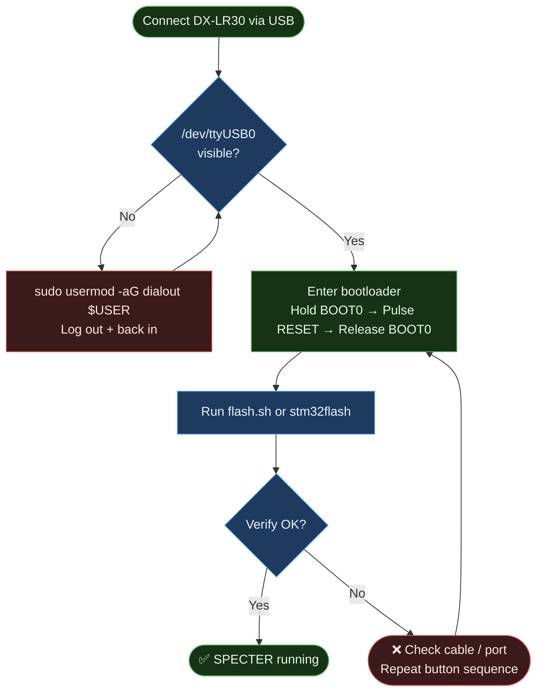
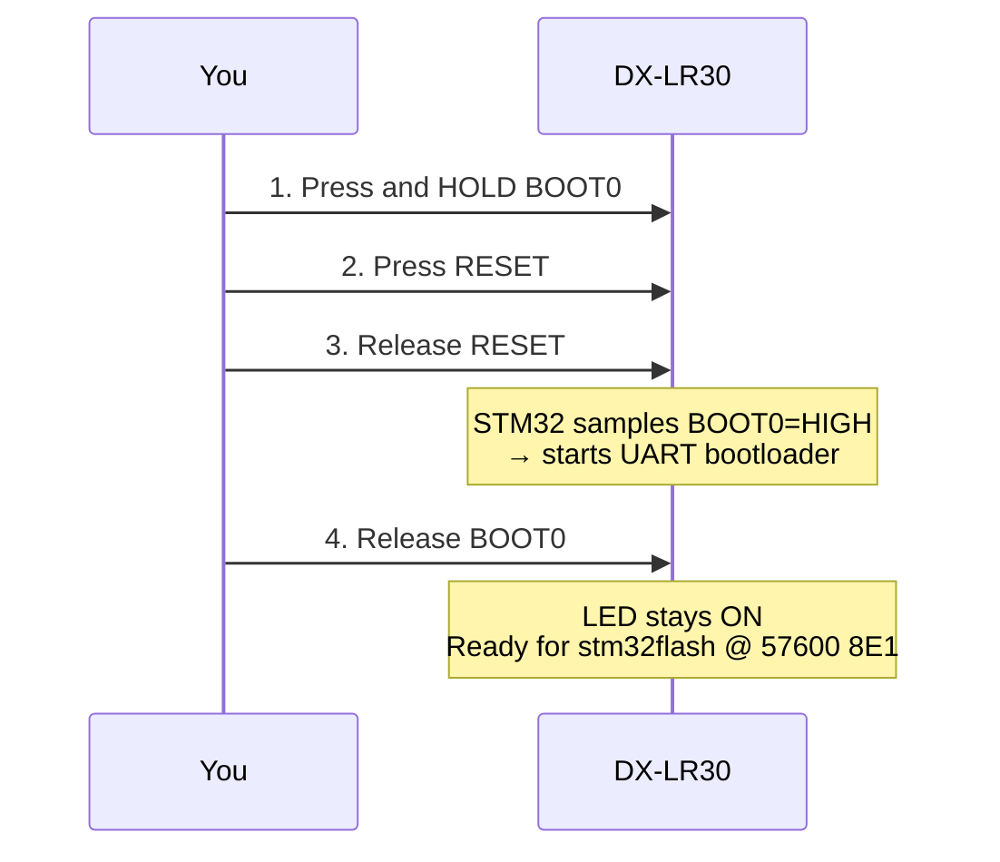

# Flashing Guide, SPECTER on DX-LR30

## Overview

The DX-LR30 uses an **STM32F103C8T6** with a factory UART bootloader accessible
via BOOT0 pin. The CH340 USB-serial chip **cannot** control BOOT0 or NRST in
software on this board, physical button interaction is required.



---

## Prerequisites

### Software

```bash
# PlatformIO (for building)
pip install platformio

# stm32flash (for flashing)
sudo apt install stm32flash       # Debian/Ubuntu
# or: brew install stm32flash     # macOS
# or: /usr/bin/stm32flash        # may already be present
```

### Permissions

```bash
# Check if your user is in dialout
groups | grep dialout

# If not:
sudo usermod -aG dialout $USER
# Log out and back in, then reconnect the device
```

### Verify device is visible

```bash
ls -la /dev/ttyUSB*
# Expected: /dev/ttyUSB0  (or ttyUSB1, etc.)
```

---

## Method 1: flash.sh (Recommended)

```bash
cd dx-lr30-fw
./flash.sh
```

The script will:
1. Build the firmware with PlatformIO
2. Print step-by-step bootloader entry instructions
3. Wait 10 seconds for you to press the buttons
4. Run stm32flash automatically

```bash
./flash.sh --no-build   # skip build, flash existing .bin
./flash.sh --monitor    # flash + open serial monitor at 115200
```

---

## Method 2: Manual Steps

### Step 1, Build

```bash
cd dx-lr30-fw
pio run -e specter
# Output: .pio/build/specter/firmware.bin
```

### Step 2, Enter Bootloader

```
┌─────────────────────────────────────────────────────┐
│  DX-LR30 top view (USB-C connector on left)         │
│                                                     │
│  [USB-C]  ┌──────────────────────────────────────┐ │
│           │                                      │ │
│           │   [BOOT0 btn]          [RESET btn]   │ │
│           │       ●                    ●         │ │
│           └──────────────────────────────────────┘ │
└─────────────────────────────────────────────────────┘

Sequence:
  1. Hold BOOT0 (keep pressed throughout)
  2. Press and release RESET
  3. Wait ~100ms
  4. Release BOOT0

The LED stays ON, the bootloader is running.
```



> ⚠️ **CRITICAL:** This board requires `-b 57600` (not 115200). See [development-notes.md](development-notes.md#critical-stm32-bootloader-baud-rate) for details.

### Step 3, Flash

```bash
stm32flash \
  -w .pio/build/specter/firmware.bin \
  -v \
  -R \
  -b 57600 \
  /dev/ttyUSB0
```

**Expected output:**

```
stm32flash 0.7

http://stm32flash.sourceforge.net/

Using Parser : Raw BINARY
Interface serial_posix: 57600 8E1
Version      : 0x22
Option 1     : 0x00
Option 2     : 0x00
Device ID    : 0x0410 (STM32F10xxx Medium-density)
- RAM        : Up to 20KiB  (512b reserved by bootloader)
- Flash      : Up to 128KiB (size first sector: 4x1024)
- Option RAM : 16b
- System RAM : 2KiB
Write to memory
Erasing memory
Wrote and verified address 0x0800a5c0 (100.00%) Done.

Starting execution at address 0x08000000... done.
```

### Step 4, Confirm

Open serial monitor immediately after flash:

```bash
python3 -m serial.tools.miniterm /dev/ttyUSB0 115200
```

Expected:
```
=== SPECTER MeshCore Repeater [SPECTER-A3F2] ===
Hash: 0xF4
Radio init... OK
Sending initial ADVERT...
Listening...
```

---

## Troubleshooting

### `Failed to init device`

```
stm32flash: Failed to init device.
```

**Cause:** The STM32 is not in bootloader mode, or wrong baud/port.

**Fix:**
1. **Use 57600 baud** (this board does NOT work reliably at 115200)
2. Repeat the button sequence, it takes practice
3. The LED should stay solid ON while in bootloader (not blinking)
4. Verify the port: `ls /dev/ttyUSB*` and adjust the command

---

### `Permission denied: /dev/ttyUSB0`

```bash
sudo chmod a+rw /dev/ttyUSB0   # temporary fix
# or:
sudo usermod -aG dialout $USER  # permanent fix (requires logout)
```

---

### No output on serial monitor

**Most common cause:** USART mapping issue (if you built custom firmware).

The Arduino STM32 framework maps `Serial` to USART2 by default.
The DX-LR30 CH340 is connected to USART1. The `ENABLE_HWSERIAL1` build
flag **must** be present in `platformio.ini`:

```ini
build_flags =
    -D HAL_UART_MODULE_ENABLED
    -D ENABLE_HWSERIAL1       ← critical
    -D RADIOLIB_STATIC_ONLY=1
    -O2
```

And in `src/main.cpp`:

```cpp
Serial1.begin(115200);    // ← must be Serial1, not Serial
```

---

### `Radio init FAILED`

Check SPI wiring (software bug, not normally an issue with stock firmware).
In production, this causes the LED to blink continuously and the device
to halt. Verify all 8 SPI/control pins are intact.

---

### Software bootloader entry (DTR/RTS) does NOT work

All tested methods fail on this specific board:

| Method | Result |
|--------|--------|
| `stm32flash -i rts,-dtr` | Timeout |
| `stm32flash -i dtr,-rts` | Timeout |
| pyserial DTR/RTS toggle | Timeout |
| stm32loader `--swap-rts-dtr` | Timeout |

**Root cause:** The CH340 on the DX-LR30 is not wired to BOOT0 or NRST.
This is by design, the original AT firmware never needed bootloader entry
via software. **Always use the physical buttons.**

---

## Re-flashing

You can re-flash at any time:
- The firmware does not lock flash or set read protection
- Just repeat the BOOT0+RESET button sequence before running `stm32flash`
- The `-R` flag in `stm32flash` resets the device automatically after flash

---

## Factory Reset

There is no factory firmware to restore, the original AT firmware was
replaced. If you want to go back to AT-command mode, you would need to
obtain the original DX-LR30 firmware binary from the manufacturer and
flash it using the same procedure.
