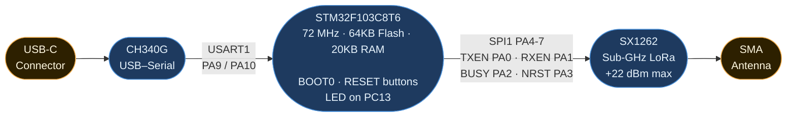
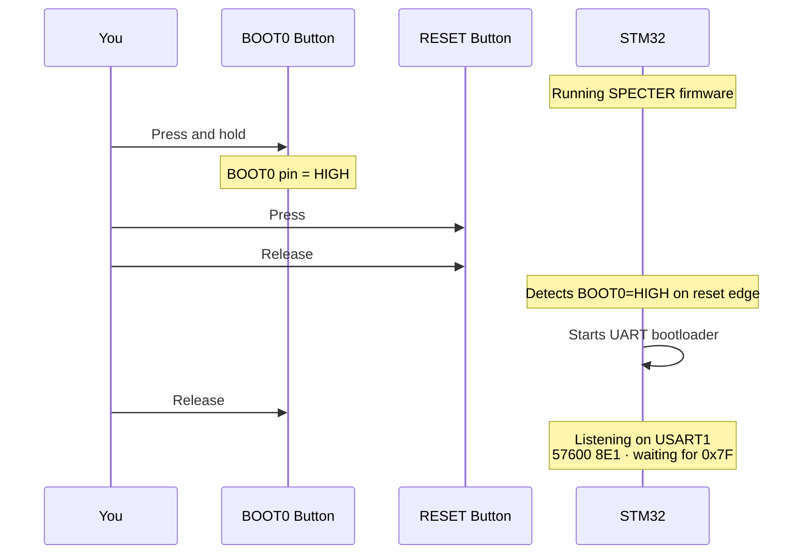

# Hardware Reference, DX-LR30

## Board Overview

The **DX-LR30** is a compact LoRa module combining an STM32F103C8T6
microcontroller with an SX1262 transceiver and a CH340 USB-serial bridge.
It was originally sold as an AT-command LoRa modem. **SPECTER** repurposes it
as a fully autonomous MeshCore repeater node.



---

## Pin Assignments

### SPI1, SX1262 Interface

| STM32 Pin | GPIO | SX1262 Pin | Direction | Description |
|-----------|------|-----------|-----------|-------------|
| 20 | PA4 | NSS | → | Chip Select (active LOW) |
| 21 | PA5 | SCK | → | SPI Clock |
| 22 | PA6 | MISO | ← | Master In Slave Out |
| 23 | PA7 | MOSI | → | Master Out Slave In |
| 15 | PA2 | BUSY | ← | Radio busy flag |
| 16 | PA3 | NRST | → | Radio hard reset |
| 10 | PA0 | TXEN | → | RF switch, TX mode |
| 11 | PA1 | RXEN | → | RF switch, RX mode |

> **Note:** DIO1 (SX1262 interrupt) is **not routed** to the STM32 on the
> DX-LR30 PCB. RadioLib operates in **polling mode** (`RADIOLIB_NC`).

### USART1, Serial Console (CH340)

| STM32 Pin | GPIO | CH340 Pin | Description |
|-----------|------|-----------|-------------|
| 29 | PA9 | RXD | Serial TX (115200 8N1) |
| 30 | PA10 | TXD | Serial RX |

> The `ENABLE_HWSERIAL1` build flag is **required** to map `Serial` to USART1.
> Without it, Arduino STM32 defaults `Serial` to USART2 and nothing appears
> on the USB port.

### Other

| GPIO | Function | Notes |
|------|----------|-------|
| PB11 | Onboard LED | Active HIGH. 1 blink = RX · 2 fast blinks = relay TX · solid ON = ADVERT TX · 5 Hz = HALT (IWDG resets in ≤ 8 s) |

---

## Bootloader Access

The CH340 on this board **cannot** toggle BOOT0 or NRST via DTR/RTS in
software (tested exhaustively, all combinations fail). Use the physical
buttons:



### STM32F103 Bootloader Specs

| Parameter | Value |
|-----------|-------|
| UART | USART1 (PA9/PA10) |
| Baud | Auto-detect from 0x7F byte |
| Frame | 8E1 (even parity) |
| Chip ID | `0x0410` (STM32F10xxx Medium-density) |
| Bootloader version | `0x22` |
| Flash base | `0x08000000` |
| Max flash | 128KB (chip supports, board has 64KB) |

---

## Power

| Source | Voltage | Notes |
|--------|---------|-------|
| USB-C | 5V | Via CH340 onboard regulator → 3.3V |
| Min current | ~80 mA | Idle, radio in RX |
| Peak current | ~150 mA | During LoRa TX burst |
| Typical powerbank | Works fine | Any 5V/500mA+ USB |

---

## Unique Device ID

The STM32F103 has a factory-programmed 96-bit unique ID at `0x1FFFF7E8`.
SPECTER uses this to derive a stable node identity without external storage.
The node name (`SPECTER-XXXX`) and 1-byte path hash are generated at boot
from this ID:

```c
const uint32_t uid[3] = {
    *(volatile uint32_t*)0x1FFFF7E8U,  // lot/wafer number
    *(volatile uint32_t*)0x1FFFF7ECU,  // X/Y coords on wafer
    *(volatile uint32_t*)0x1FFFF7F0U,  // lot number
};
// → auto-generates name: "SPECTER-XXXX" (last 16 bits of uid[2])
// → mixed into 32-byte pseudo-pubkey
// → first byte of pubkey = path hash (unique per device)
```

This ensures each DX-LR30 unit gets a **different name and hash**
automatically, even without any configuration.
