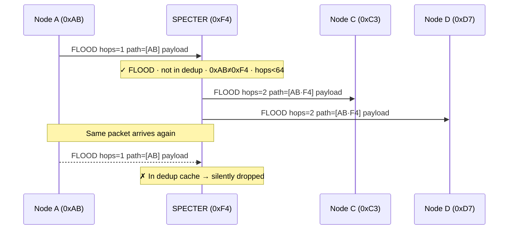
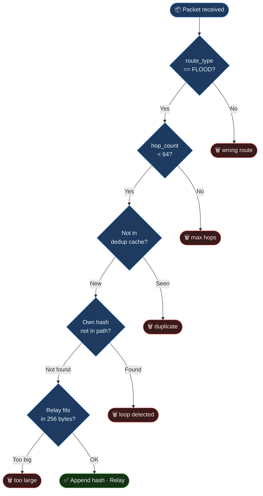
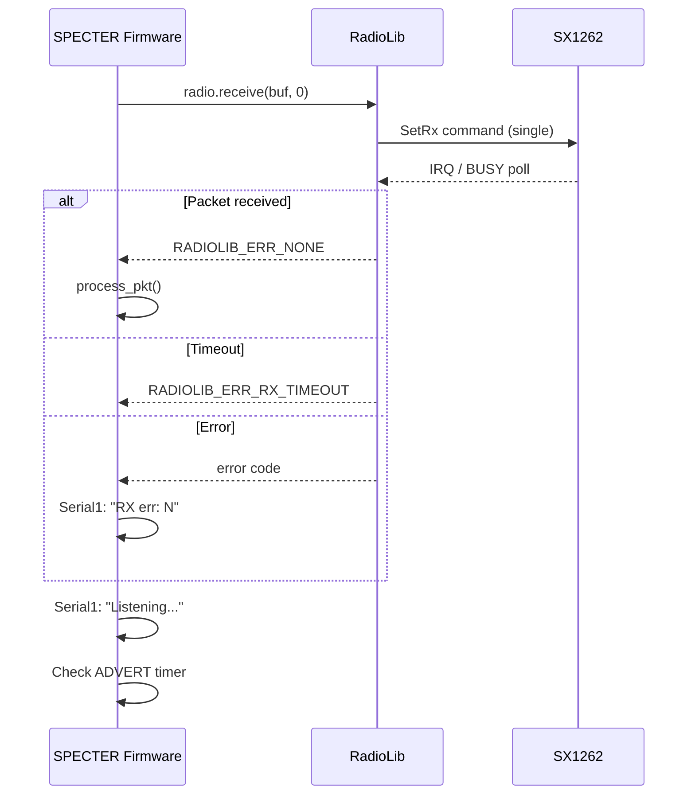

# MeshCore Protocol Reference, SPECTER Implementation

## Overview

MeshCore is a decentralized LoRa mesh protocol using **flood routing** with
loop prevention via path hashes. SPECTER implements the v1 flood repeater role.



---

## Packet Format

### Header Byte (Byte 0)

```
 7   6   5   4   3   2   1   0
┌───┬───┬───┬───┬───┬───┬───┬───┐
│ V │ V │ P │ P │ P │ P │ R │ R │
└───┴───┴───┴───┴───┴───┴───┴───┘
  VV = payload version (0)
        PPPP = payload type
                    RR = route type
```

| Field | Bits | Values |
|-------|------|--------|
| `route_type` | [1:0] | `0x00`=TRANSPORT_FLOOD · `0x01`=FLOOD · `0x02`=DIRECT · `0x03`=TRANSPORT_DIRECT |
| `payload_type` | [5:2] | `0x04`=ADVERT · `0x01`=MSG · `0x06`=TRACE · … |
| `payload_version` | [7:6] | `0x00` (v1) |

**SPECTER only processes `route_type = FLOOD (0x01)`.**

### Path Header Byte (Byte 1)

```
 7   6   5   4   3   2   1   0
┌───┬───┬───┬───┬───┬───┬───┬───┐
│HS │HS │ HC│ HC│ HC│ HC│ HC│ HC│
└───┴───┴───┴───┴───┴───┴───┴───┘
  HS = hash_size_code (0=1B, 1=2B, 2=3B, 3=4B)
        HC = hop_count (0–63)
```

### Full Packet Layout

```
┌──────────┬──────────┬──────────────────────┬─────────────────────────┐
│ Header   │ Path Hdr │ Path Hashes          │ Payload                 │
│ (1 byte) │ (1 byte) │ (hop_count×hash_size)│ (variable)              │
└──────────┴──────────┴──────────────────────┴─────────────────────────┘
```

---

## ADVERT Payload

Sent on boot (after 5s) and every 12 hours.

```
┌─────────────────┬──────────────────┬──────────────────┬────────────────┐
│ pubkey          │ timestamp        │ signature        │ appdata        │
│ 32 bytes        │ 4 bytes (LE)     │ 64 bytes         │ variable       │
└─────────────────┴──────────────────┴──────────────────┴────────────────┘
```

### Appdata example (node name = "SPECTER-A3F2")

```
┌──────────┬────────────────────┐
│ flags    │ name               │
│ 1 byte   │ ASCII, no NUL      │
└──────────┴────────────────────┘

flags = 0x82:
  bit 1 (0x02) = FLAG_IS_REPEATER
  bit 7 (0x80) = FLAG_HAS_NAME
name  = "SPECTER-A3F2" (auto, 12 bytes) or custom if NODE_NAME_STR set
```

### Ed25519 Signature

The 64-byte signature field is computed using **Ed25519**:

```
signature = Ed25519.sign(
    private_key,
    public_key,
    pubkey || timestamp || appdata
)
```

- **Private key**: Derived deterministically from STM32 UID via `SHA256(domain_string + UID)`
- **Public key**: Derived from private key via `Ed25519::derivePublicKey()`
- **Signed data**: Concatenation of pubkey (32B) + timestamp (4B) + appdata (variable)

⚠️ **MeshCore companions validate signatures.** Unsigned or incorrectly signed
ADVERTs are silently discarded. This was the root cause of "0 repeaters" during
early development. See [development-notes.md](development-notes.md#ed25519-signature-requirement)
for details.

**Library used:** [rweather/Crypto](https://github.com/rweather/arduinolibs/tree/master/libraries/Crypto) v0.4.0

---

## Flood Relay Rules

SPECTER applies these checks **in order** before relaying:



### Dedup Cache

- Size: **64 slots** (circular buffer)
- Fingerprint: `payload_type (1B) + first 5 bytes of payload`
- When a packet is seen again → silently dropped, `"Drop: dedup"` logged
- Cache survives until reboot (no persistence)

---

## Timing

| Event | Timing |
|-------|--------|
| First ADVERT | 5 seconds after boot |
| Periodic ADVERT | Every 12 hours |
| CSMA backoff before TX | 300–800 ms random |
| RX cycle | Blocking `receive()` call |

---

## Radio Layer

RadioLib SX1262 in **single-packet RX** mode (no continuous mode).



---

## Compatibility

SPECTER is compatible with any MeshCore v1 node using the same radio settings:

| Parameter | Value |
|-----------|-------|
| Frequency | 869.618 MHz |
| Spreading Factor | SF8 |
| Bandwidth | 62.5 kHz |
| Coding Rate | 4/5 |
| Sync Word | `0x12` (LoRa private) |
| Preamble | 8 symbols |

Compatible devices include: Heltec LoRa32, RAK WisBlock, T-Beam, and any
node running the official MeshCore firmware on the same EU868 channel.
